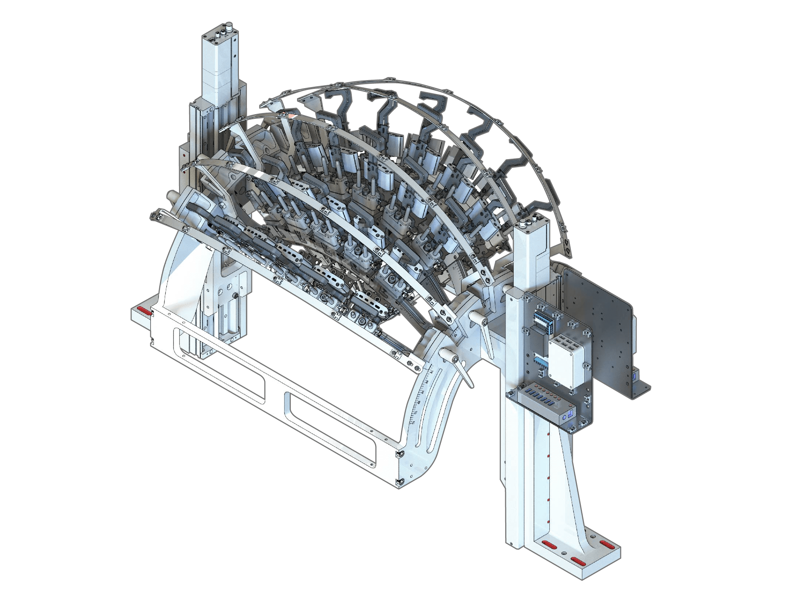
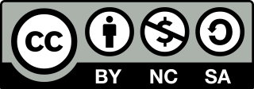

# Modular Insertion System

A flexible, scalable extracellular electrophysiology rig




## Key features

- Insertion angles up to ±75° A/P and ±45° M/L
- Modules for electrophysiology, optogenetics, and fiber photometry
- 600 mm x 500 mm open area for behavioral platform
- Design files available for noncommercial use

## Contributors

- Mechanical design: Jon Arnold
- Concept and oversight: Josh Siegle, Karel Svoboda
- Validation: Galen Lynch, Yoni Browning, Anna Lakunina, Xinxin Yin, Han Hou, Susu Chen
- Electrical design: Sonya Vasquez


## How to order

In most cases, we recommend waiting to purchase a fully assembled system from New Scale Technologies (available in late 2024).

If you would like to manufacture the individual components and build the system yourself, we strongly recommend [posting an issue](https://github.com/AllenNeuralDynamics/modular-insertion-system/issues) before getting started so we can provide advice on the ideal configuration for your experiments.


## Documentation

A web-based documentation site is currently under development. Until that is launched, you'll have to follow these instructions to build the documentation yourself.

First, make sure [Sphinx](https://www.sphinx-doc.org/en/master/usage/installation.html) is installed on your system.

Then, in a Python virtual environment (e.g. `conda`), run

```
pip install -e .[docs]
```

To create the documentation HTML files, run

```
sphinx-build -b html documentation/source/ documentation/build/html
```

## License

The contents of this repository are covered by the [Creative Commons BY-NC-SA License](LICENSE). Any design files or documentation, or modifications thereof, cannot be used for commercial purposes without prior written consent from the Allen Institute. In other words, you are allowed to build the system for use in your own lab, but you cannot sell the drawings, models, or physical components. Any derivations must be attributed to the Allen Institute and shared with the same licensing terms.


